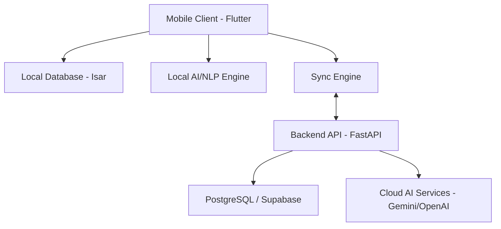

# Architecture & Engineering Document

## 1. High-Level Architecture
WalletMind utilizes a **Mobile-First, Offline-First** architecture. The core application logic, NLP parsing, and data storage reside primarily on the edge (the user's device). Cloud infrastructure is utilized for cross-device synchronization, advanced heavy-compute AI models (if local models are insufficient), and backup/recovery.



## 2. Low-Level Architecture & Clean Architecture
We adhere strictly to **Clean Architecture** principles to separate concerns, making the app highly testable and independent of external frameworks.

Each feature is divided into three layers:
1. **Domain Layer**: Core business rules, Entities, and abstract Repository interfaces. (Independent of any other layer).
2. **Data Layer**: Repository implementations, Data Sources (Local/Remote), and DTOs (Data Transfer Objects).
3. **Presentation Layer**: UI (Widgets, Pages) and State Management (ViewModels/Providers).

## 3. Modular Feature-Based Folder Structure
Instead of grouping by type (e.g., all models together, all screens together), we group by **Feature**.

### Frontend Structure (Flutter)
```text
lib/
├── core/                       # App-wide shared resources
│   ├── theme/                  # Design tokens, colors, typography
│   ├── network/                # API clients, interceptors
│   ├── storage/                # Local database setup
│   ├── utils/                  # Formatters, validators, extensions
│   ├── widgets/                # Shared generic UI components
│   └── errors/                 # Failure classes, exceptions
├── features/                   # Feature modules
│   ├── chat/
│   │   ├── domain/             # Entities, UseCases
│   │   ├── data/               # Models, Repositories, DataSources
│   │   └── presentation/       # Screens, Widgets, Providers
│   ├── dashboard/
│   ├── analytics/
│   ├── transactions/
│   └── settings/
├── app.dart                    # App configuration (Theme, Router setup)
└── main.dart                   # Bootstrapping, DI initialization
```

### Backend Structure (FastAPI - Python)
```text
src/
├── api/
│   ├── routes/                 # API endpoints (routers)
│   ├── dependencies.py         # FastAPI Depends (auth, db sessions)
├── core/
│   ├── config.py               # Env vars, settings
│   ├── security.py             # JWT, hashing
│   └── exceptions.py           # Custom exception handlers
├── domain/                     # Business logic & models
│   ├── models/                 # SQLAlchemy ORM models
│   └── schemas/                # Pydantic schemas
├── services/                   # Business logic implementations
│   ├── ai_service.py           # LLM interactions
│   └── sync_service.py         # Conflict resolution logic
├── tests/                      # Pytest suite
└── main.py                     # ASGI app entry point
```

## 4. Application Flow & Data Flow
**Data Flow (Unidirectional)**:
UI Action -> StateNotifier/Controller -> UseCase -> Repository -> Local DB -> State Updates -> UI Rebuilds.

**MVVM via Riverpod**:
We use **Riverpod** for state management. Providers supply immutable state to the UI. The UI triggers methods on `Notifier` classes which interact with Use Cases or Repositories.

## 5. Offline-First Strategy & Sync Architecture
1. **Local Writes**: All user actions (creates, updates, deletes) are immediately written to the local **Isar Database**. The UI is updated instantly (Optimistic UI).
2. **Sync Queue**: Actions are recorded in a local sync queue.
3. **Background Sync**: When network is available, the sync engine pushes the queue to the backend.
4. **Conflict Resolution**: Handled via CRDTs (Conflict-free Replicated Data Types) or Last-Write-Wins (LWW) based on logical timestamps.

## 6. AI Service Layer
- **Local NLP (v1)**: Uses compiled Regex and keyword heuristics for immediate, offline parsing of 90% of standard transactions.
- **Cloud LLM Fallback (v2)**: If local parsing confidence is low, the query is sent to a Cloud LLM (e.g., Google Gemini) with structured JSON output instructions.

## 7. Voice & OCR Pipelines
- **Voice**: Utilizes native platform speech recognition (`speech_to_text`). Streams output continuously to the chat input, triggering NLP parsing on silence/submit.
- **OCR**: Uses Google ML Kit (on-device) to extract text blocks. Heuristic algorithms search for "Total", Dates, and Merchant headers. Cloud vision APIs used only if the user explicitly requests high-accuracy extraction.

## 8. Security Architecture
- **Data at Rest**: Isar database encryption enabled using platform secure storage keys (Keychain/Keystore).
- **Authentication**: JWT-based auth for API. Short-lived access tokens, long-lived refresh tokens securely stored.
- **Transport**: Strict TLS 1.3 requirement. Certificate pinning for critical API endpoints.
- **App Lock**: `local_auth` package to require biometric validation upon app resume.

## 9. Analytics & Logging
- **Analytics**: Privacy-first, anonymous event tracking (e.g., PostHog or custom backend). No transaction amounts or personal text are ever tracked.
- **Logging**: Use a structured logger (`logger` package). Logs are written to local files and can be exported by the user for support. Crashlytics for fatal exceptions.

## 10. CI/CD & Environment Management
- **Environments**: `dev`, `staging`, `prod`. Managed via `.env` files and Dart `--dart-define`.
- **CI/CD Pipeline (GitHub Actions)**:
  1. Trigger on PR: Run `flutter analyze`, `flutter test`.
  2. Trigger on Merge to Main: Build Android App Bundle (AAB) and iOS IPA.
  3. Deploy to Firebase App Distribution for internal testing.
  4. Manual trigger to deploy to Google Play Console / App Store Connect.
